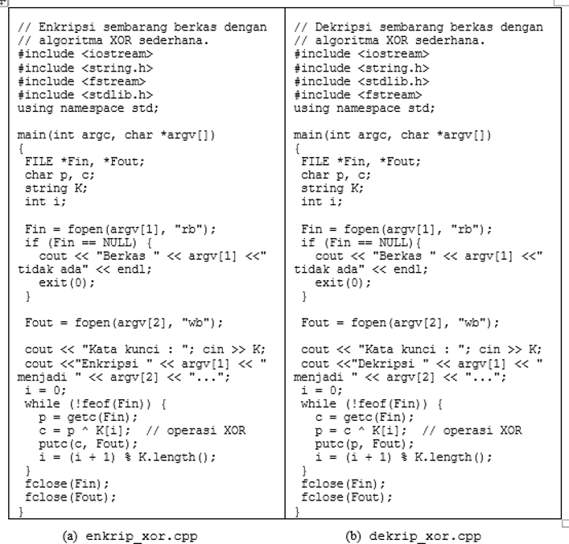

# KRIPTOGRAFI

TUGAS PERTEMUAN KE 14

Membuat codingan dengan menggunakan XOR untuk Enkripsi dan Deskripsi dari materi 
yang telah disampaikan, codingan simpan pada Repositori (Githubs aau Gitlabs) dan yang diupload di ecampus
hanya link Githubs atau link Gitlabs

# Scrip C++ Operasi XOR

